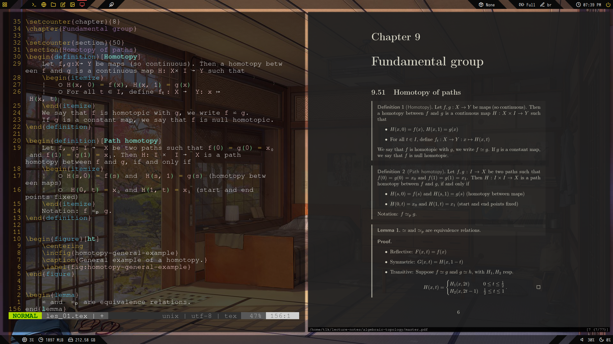
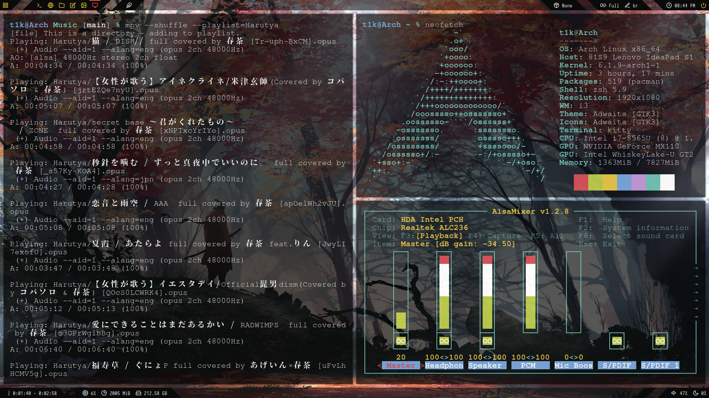
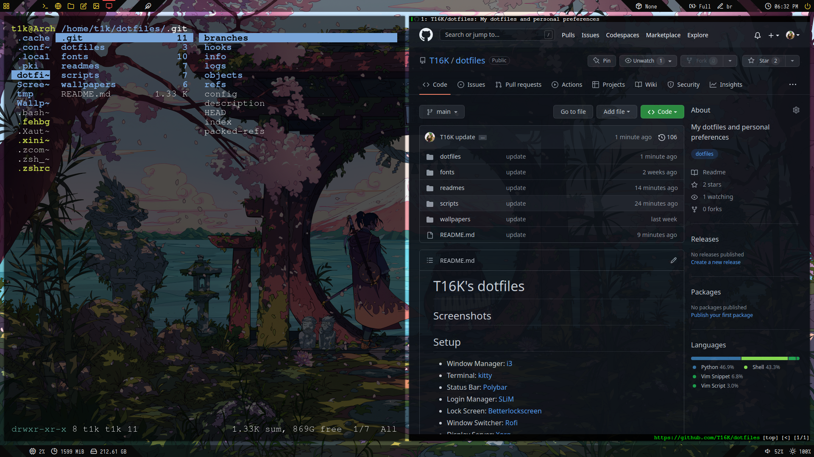

# T16K's dotfiles

## Screenshots





## Setup

- Window Manager: [i3](https://wiki.archlinux.org/title/I3)
- Terminal: [kitty](https://wiki.archlinux.org/title/Kitty)
- Status Bar: [Polybar](https://wiki.archlinux.org/title/Polybar)
- Login Manager: [SLiM](https://wiki.archlinux.org/title/SLiM)
- Lock Screen: [Betterlockscreen](https://github.com/betterlockscreen/betterlockscreen)
- Window Switcher: [Rofi](https://wiki.archlinux.org/title/Rofi)
- Display Server: [Xorg](https://wiki.archlinux.org/title/Xorg)

## Applications

- Shell: [Zsh](https://wiki.archlinux.org/title/Zsh)
- Text Editor: [Neovim](https://wiki.archlinux.org/title/Neovim)
- Web Browser: [qutebrowser](https://wiki.archlinux.org/title/Qutebrowser)
- Media Player: [mpv](https://wiki.archlinux.org/title/Mpv)
- File Manager: [ranger](https://wiki.archlinux.org/title/Ranger)
- Package Manager: [Yay](https://github.com/Jguer/yay)
- Document Viewer: [zathura](https://wiki.archlinux.org/title/Zathura)

## Installation

1. Clone this repository:
```
# git clone https://github.com/T16K/dotfiles.git
```

2. Run the scripts.
